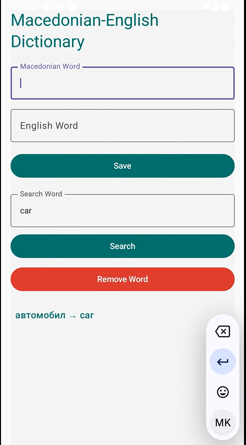

# Simple Dictionary App

A simple Android app for saving and managing Macedonian-English word translations.

## Features
- Save Macedonian-English word pairs.
- Search for words in both Macedonian and English.
- Remove words from the dictionary.
- Stores data locally in a file (dictionary.txt).

## Screenshot

## How to Use
1. Enter a Macedonian word and its English translation in the input fields.
2. Click "Save" to add the word pair to the dictionary.
3. Use the Search bar to look up translations.
4. Click "Remove Word" to delete an entry from the dictionary.

## Demo
Here’s a screen recording of the app in action:

[https://github.com/user-attachments/assets/bc9ce39d-202f-4318-b2b8-34ce6186cc53](https://github.com/user-attachments/assets/d9581773-4a09-4386-8867-0697dfe7212d)
